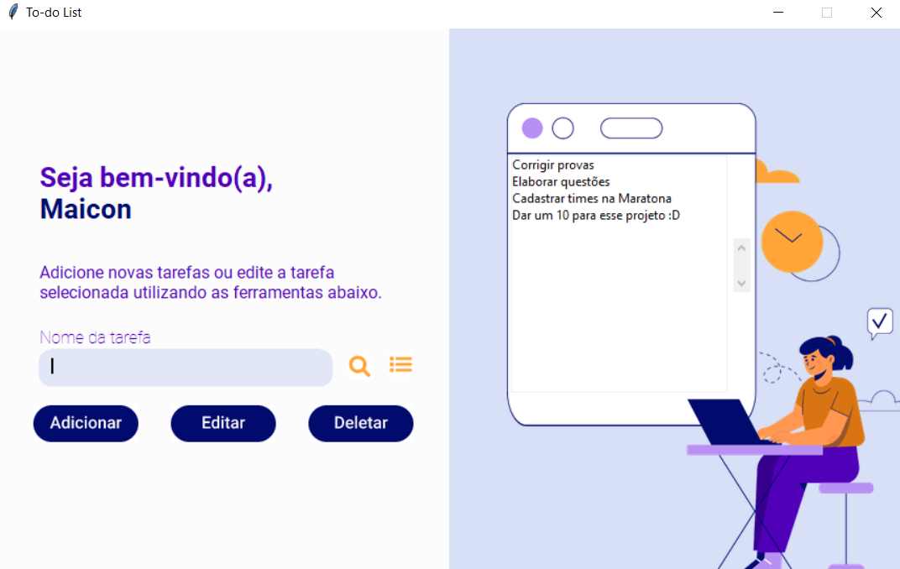

# Projeto 01 - POO
## Todo List

Para inicializar o projeto:  
* No windows, execute o arquivo `start.bat`
* Em sistemas Unix, execute o arquivo `start.sh`

## Relatório  

### Introdução:  

Neste projeto, desenvolvemos uma aplicação denominada “Todo List” que opera como uma lista de tarefas digital. É possível, a partir dela, adicionar, editar, completar e excluir tarefas. A aplicação possui duas telas, cuja aparência e funcionalidades podem ser observadas abaixo:  

### Tela 1 - Tela de Início

A tela de início é o primeiro contato do usuário com a aplicação. O usuário deve inserir como deseja ser chamado na caixa de texto e clicar no botão “Iniciar”, que o encaminhará para a  próxima tela.  

### Tela 2 - Tela Principal

A segunda tela é mais complexa, nela se encontra a lista de tarefas e os botões para alterá-la. A lista está na direita da tela, e possui três interações:  

* Ao clicar uma vez em um item listado, você o seleciona;  
* Ao clicar duas vezes em um item listado, você o completa;  
* Você pode navegar pela lista utilizando a barra de rolagem.  

Na esquerda da tela, há uma caixa de texto e cinco botões, que podem ser combinados das seguintes maneiras:  

* Ao escrever o nome da tarefa na caixa de texto e clicar em “adicionar”, a tarefa é adicionada à lista;  
* Para editar uma tarefa, basta selecionar o item desejado, digitar as alterações e clicar em “editar”;  
* Para deletar uma tarefa, é preciso selecionar o item desejado e clicar em “deletar”;  
* Você pode procurar por uma tarefa digitando seu nome na caixa de texto e clicando no botão “lupa”;  
* Após fazer uma pesquisa, para voltar a visualizar a lista completa, basta clicar no botão “view all” ao lado da lupa.  

